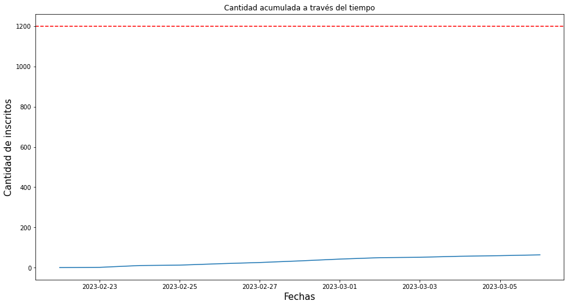

# <span style="color:gold">Proyección de Ventas con Python</span>

### En este ejemplo, utilizaremos las librerías Pandas y Matplotlib para cargar y visualizar datos de un archivo Excel que contiene información sobre la cantidad de inscritos en un evento a lo largo del tiempo. Veremos cómo Pandas nos permite manipular y agregar información a un DataFrame, mientras que Matplotlib nos permitirá crear un gráfico para visualizar la evolución de la cantidad de inscritos en el evento. ###
<br><br>


-   Como primer paso se importa las librerías Pandas y Matplotlib
```
import pandas as pd                    
import matplotlib.pyplot as plt  
```


- Se carga el archivo Excel en un DataFrame llamado 'df'
```
df = pd.read_excel('/content/Open_Abril_Resultados.xlsx')
```


- Se agrega una nueva columna llamada 'Cantidad Acumulada' que contiene la suma acumulada de la columna 'Cantidad'
```
df['Cantidad Acumulada'] = df['Cantidad'].cumsum()
```


- Se crea una figura y un eje
```
fig, ax = plt.subplots(figsize=(15.5, 8))
```


- Se traza un gráfico de línea utilizando los datos de las columnas 'Fecha' y 'Cantidad Acumulada' del DataFrame 'df'
```
ax.plot(df['Fecha'], df['Cantidad Acumulada'])
```

- Se establecen etiquetas para los ejes y un título para el gráfico
```
ax.set_xlabel('Fecha', fontsize=15)
ax.set_ylabel('Cantidad de inscritos', fontsize=15)
ax.set_title('Cantidad acumulada a través del tiempo')
```

-Se traza una línea horizontal roja punteada en el valor 1000 en el eje Y
```
ax.axhline(y=1000, color='r', linestyle='--')
```

-Se muestra el gráfico

```
plt.show()
```




- En conclusión, este ejemplo mediante el uso de las librerías Pandas y Matplotlib podemos crear una gráfica que muestra la cantidad acumulada de inscritos en un evento a lo largo del tiempo y una línea horizontal que representa un valor de referencia. Este tipo de gráfico es útil para visualizar la evolución de una variable a lo largo del tiempo y puede ser utilizado para identificar tendencias o patrones en los datos. El código también demuestra cómo cargar datos de un archivo Excel en un DataFrame de Pandas y cómo agregar una nueva columna al DataFrame utilizando una función de Pandas.

